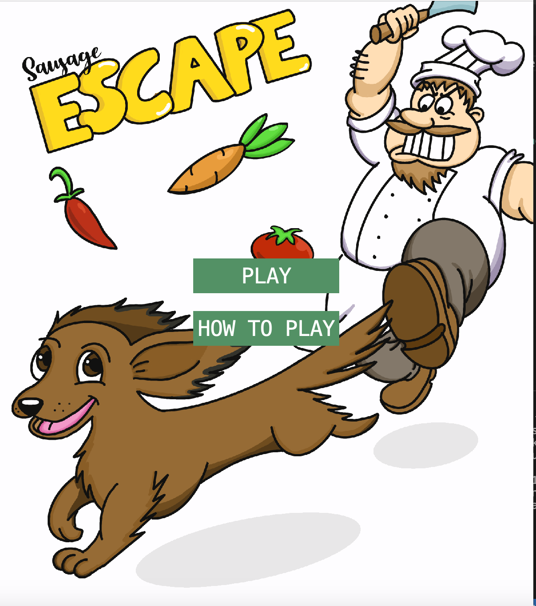

# Sausage Escape

Sausage Escape is a platform game where you play as a dog escaping from a chef that wants to eat you. The only way to survive is to reach your home in the woods!

This was a project in INF101 at the university of Bergen in 2023.

## How to play

Run the program by clicking on the "Run" button in an IDE. Once the game is up and running, click 'PLAY' to start the game or 'HOW TO PLAY' to read the game instructions.

### Player movements

- Use the left arrow key to move the player to the left.
- Use the right arrow key to move the player to the right.

### Enemies

- Getting caught by the chef means instant death and the game ends.
- Getting hit by vegetable enemies reduces the player's life by 1.

The player has 3 lives and when the player has zero lives left the game ends.

### How to win

Reach the dog house to win!

## Link to video

- [Game demo video] (https://www.youtube.com/watch?v=grYIgxAfV-g)

## Assets

- All screens and sprites were made by me.

## Acknowledgements

Code sources and inspiration:

- [RyiSnow] (https://www.youtube.com/watch?v=ugzxCcpoSdE)
- [Kaarin Gaming] (https://www.youtube.com/watch?v=nuRXTWJ66vc&list=PL4rzdwizLaxYmltJQRjq18a9gsSyEQQ-0&index=6)
- [RealTutsGML] (https://www.youtube.com/watch?v=vdcOIwkB6dA)
- [Mr.Polywhirl] (https://stackoverflow.com/questions/11006394/is-there-a-simple-way-to-compare-bufferedimage-instances)
- [Java2s.com] (http://www.java2s.com/Tutorial/Java/0261__2D-Graphics/Ifthebufferedimagesupportstransparency.html)
